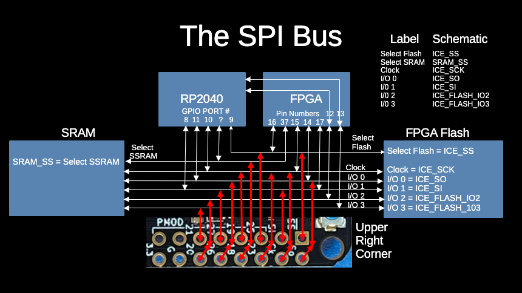
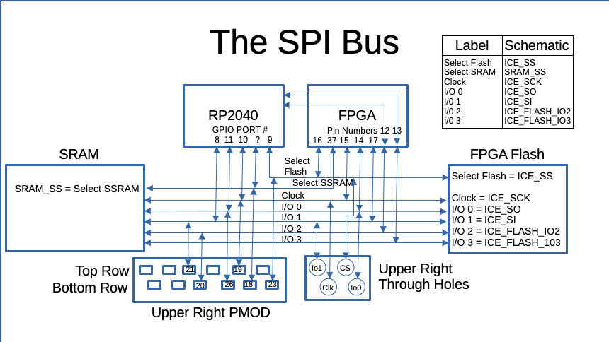

# Pinout Diagram

This diagram shows the ICE40 and RP2040 names for the through holes on the pico-ice board. 

[SVG](pinout/pinout.svg)
| [PNG](pinout/pinout.png)
| [RP2040](https://www.raspberrypi.com/documentation/pico-sdk/hardware.html#autotoc_md0)
| [ICE40](https://www.latticesemi.com/view_document?document_id=51971)

## With RTL on the iCE40

To program the FPGA, one needs to tell the synthesis tools which pins to connect to the signals in your RTL.  There are two different ways to name the pins.   The wafer names are words like `IOB_6a` and `IOT_8b`, and the pin numbers have names like `ICE_2`, `ICE_3`, and `ICE_4`.
Both sets of names can be found in this [PCF file](https://github.com/tinyvision-ai-inc/pico-ice-sdk/blob/main/rtl/pico_ice.pcf).

For Amaranth, until this gets upstreamed, the various board resources including its pins are defined on
[`pico_ice.py`](https://github.com/tinyvision-ai-inc/pico-ice-sdk/blob/main/amaranth/pico_ice.py).

## With code on the RP2040

The FPGA pins and other signals are defined in [`pico_ice.h`](https://github.com/tinyvision-ai-inc/pico-ice-sdk/blob/main/include/boards/pico_ice.h).

The PMOD pins can also be accessed from
[`pmod.h`](https://github.com/tinyvision-ai-inc/pico-ice-sdk/blob/main/include/pmod.h) and
[`ice_pmod.h`](https://github.com/tinyvision-ai-inc/pico-ice-sdk/blob/main/include/ice_pmod.h).

## SPI Pinouts 

For debugging the FPGA <-> SPI <-> Flash/RAM interface it is very helpful to use the 4 through holes on the upper right of the FPGA, and to connect a logic analyzer to the upper right PMOD.  These two diagrams may help.  Remember that the default boot process leaves the Flash switched ``off``.  With the Yosys icepack command, the ``-s`` option boots the Flash in the ``on`` state. 

